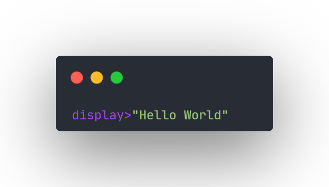
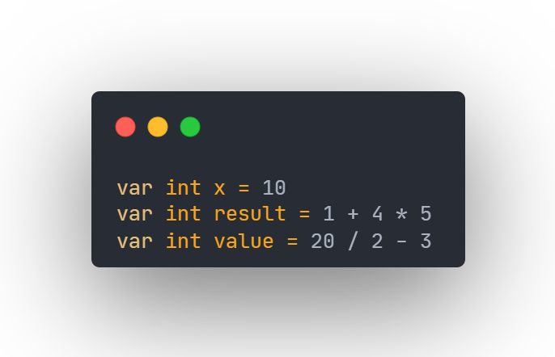
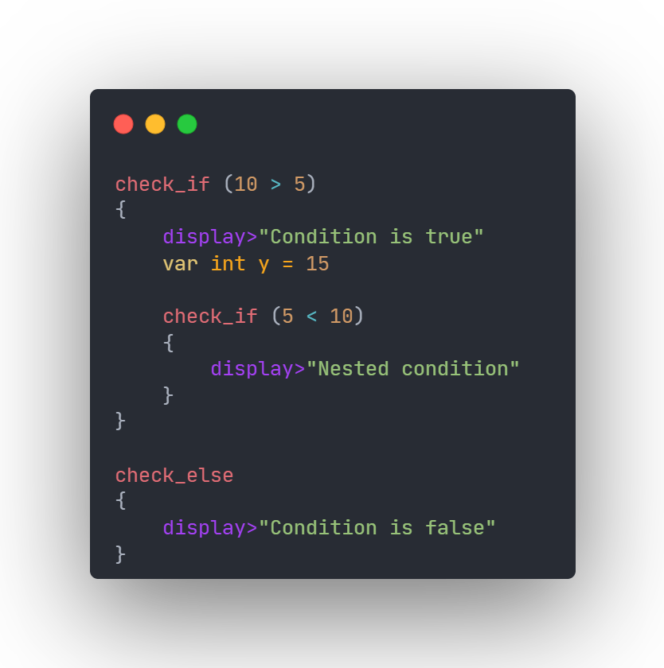
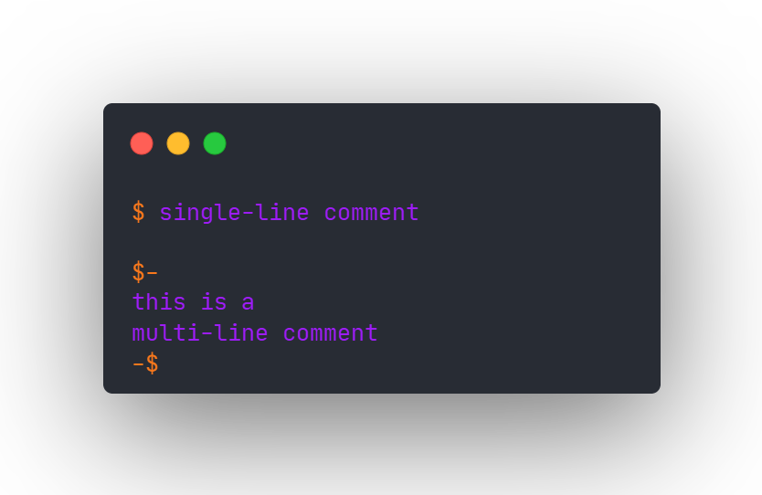

# FOX.fox

**A small programming language and compiler written from scratch in C.**

---

FOX started as a challenge between me and my friend to build our own programming languages and compilers from scratch.

Friend's GitHub: [@Yukari](https://github.com/Yukari-dev)

  

---

### About

FOX is a custom-built language with its own lexer, parser, and AST, compiled entirely in C.

Every feature, from tokenization to control flow, is implemented from the ground up.

---

### Hello World

---

### Variables

---

### Conditions

---

### Comments

---

### Supported Features

- Lexer
- Tokenization
- AST
- `int` variables
- `+  -  *  /`
- Operator precedence
- `>  <  >=  <=  ==  !=`
- `display`
- `check_if`
- `check_else`
- Nested `check_if`
- Multiple statements inside blocks
- Single-line comments
- Multi-line comments

---

**FOX** is just getting started. I’m building it step by step, adding new features as I learn more about how compilers work under the hood.

---

## License

FOX is released under the MIT License.

You’re free to use, modify, and share the project. See the [LICENSE](./LICENSE) file for details.
